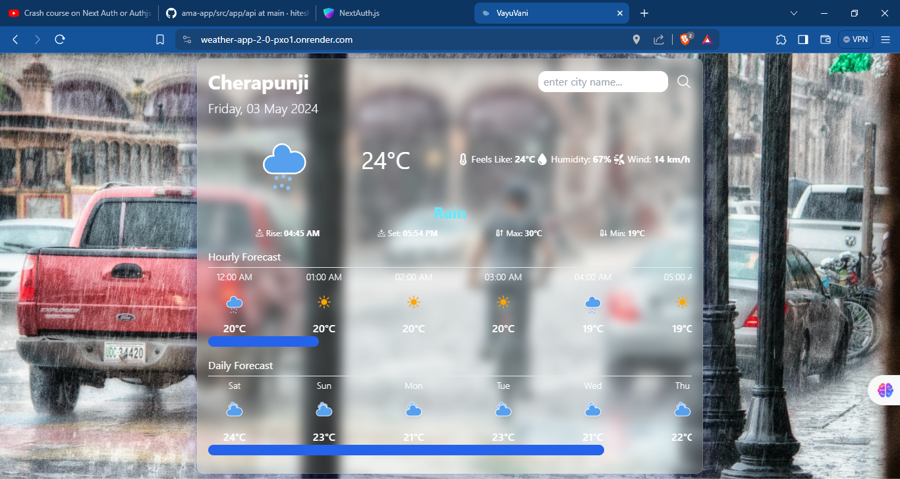
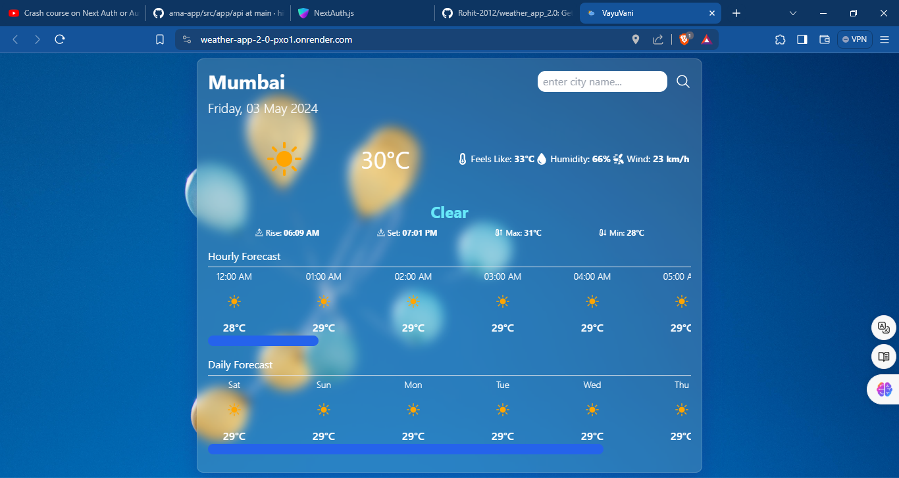
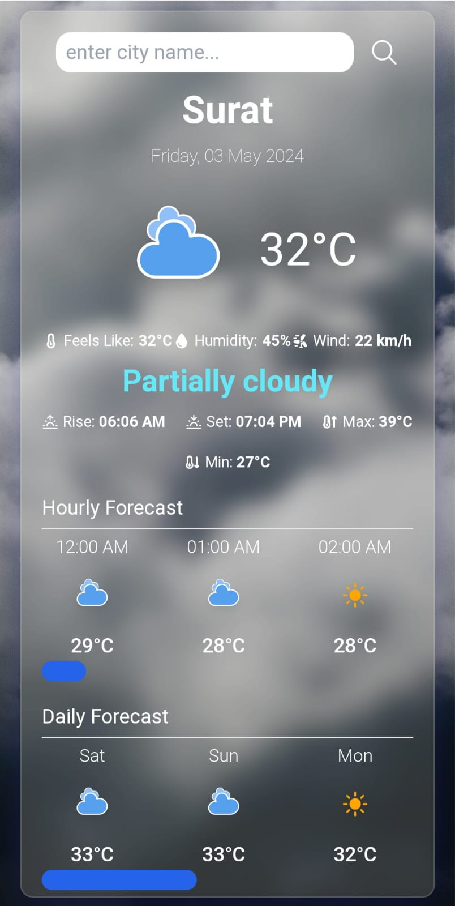
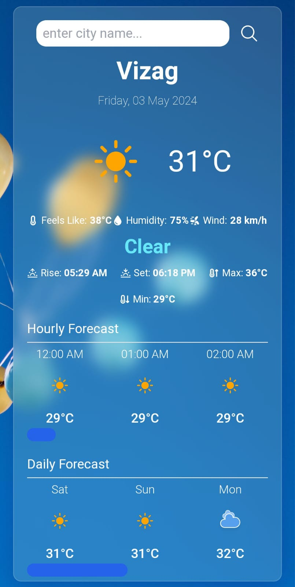

# VayuVani Weather App

This is a frontend weather app created using Reactjs, Vite, Axios, Redux Toolkit, React Redux, and Luxon. The app fetches weather data from the user's current location using the geolocation API. Users can also search for weather data of different cities.

## Features

- Fetches current weather and conditions
- Provides hourly forecast for 24 hours
- Displays daily weather forecast for the next 7 days
- Dynamically changes background based on weather conditions

## Preview

## Demo

Check out the live demo [here](https://weather-app-2-0-pxo1.onrender.com).

## Technologies Used

- Reactjs
- Vite
- Axios
- Redux Toolkit
- React Redux
- Luxon

## Getting Started

To get a local copy up and running, follow these steps:

1. Clone the repository
2. Install dependencies using `npm install`
3. Register on https://www.visualcrossing.com and https://geocode.maps.co to get API key for weather data and geocoding
4. Create .env file in the root directory and add weather API key as VITE_API_KEY and geocoding API key as VITE_GEOCODING_API_KEY
5. Run the development server using `npm run dev`

## Usage

- Upon opening the app, it will ask for location permission to fetch weather data for the user's current location.
- Users can also search for weather data of different cities using the search feature.

## Contributing

Contributions are welcome! If you'd like to contribute to this project, please follow these steps:

1. Fork the repository
2. Create your feature branch (`git checkout -b feature/YourFeature`)
3. Commit your changes (`git commit -am 'Add some feature'`)
4. Push to the branch (`git push origin feature/YourFeature`)
5. Open a pull request
